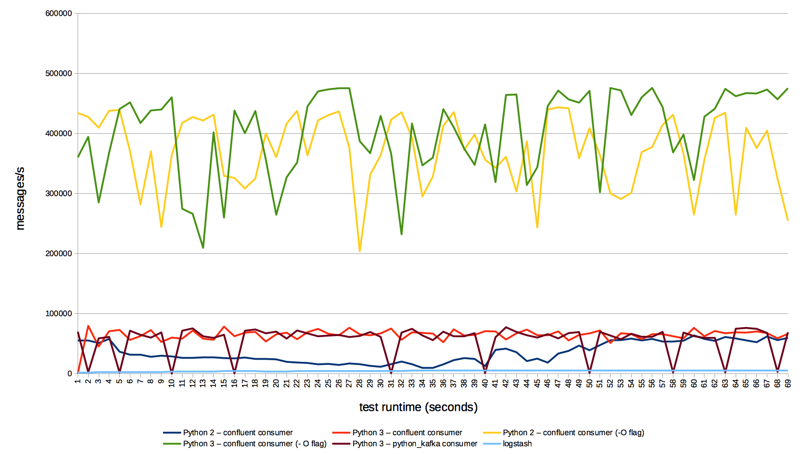

# Kafka-InfluxDB


[](https://travis-ci.org/mre/kafka-influxdb)
[](https://codecov.io/gh/mre/kafka-influxdb)
[](https://codeclimate.com/github/mre/kafka-influxdb)
[](https://badge.fury.io/py/kafka\_influxdb)
[](https://scrutinizer-ci.com/g/mre/kafka-influxdb/?branch=master)

A Kafka consumer for InfluxDB written in Python.  
Supports InfluxDB 0.9.x and up. For InfluxDB 0.8.x support, check out the [0.3.0 tag](https://github.com/mre/kafka-influxdb/tree/v0.3.0).

## Use cases

Kafka will serve as a buffer for your metric data during high load.  
Also it's useful for sending metrics from offshore data centers with unreliable connections to your monitoring backend.


## Quickstart

For a quick test, run kafka-influxdb inside a container alongside Kafka and InfluxDB. Some sample messages are generated automatically on startup (using kafkacat).

#### Python 2:

```
make
docker exec -it kafkainfluxdb
python -m kafka_influxdb -c config_example.yaml -s
```

#### Python 3:

```
make RUNTIME=py3
docker exec -it kafkainfluxdb
python -m kafka_influxdb -c config_example.yaml -s
```

#### PyPy 5.x

```
make RUNTIME=pypy
docker exec -it kafkainfluxdb
pypy3 -m kafka_influxdb -c config_example.yaml -s --kafka_reader=kafka_influxdb.reader.kafka_python
```

(Note that one additional flag is given: `--kafka_reader=kafka_influxdb.reader.kafka_python`. This is because PyPy is incompabile with the confluent kafka consumer which is a C-extension to librdkafka. Therefore we use the kafka\_python library here, which is compatible with PyPy but a bit slower.)

## Installation

```
pip install kafka_influxdb
kafka_influxdb -c config-example.yaml
```

## Performance


The following graph shows the number of messages/s read from Kafka for various Python versions and Kafka consumer plugins.  
This is testing against a Kafka topic with 10 partitions and five message brokers.
As you can see the best performance is achieved on Python 3 using the `-O` flag for bytecode optimization in combination with the `confluent-kafka` reader (default setup). Note that encoding and sending the data to InfluxDB might lower this maximum performance although you should still see a significant performance boost compared to logstash.




## Benchmark


For a quick benchmark, you can start a complete `kafkacat -> Kafka -> kafka_influxdb -> Influxdb` setup with the following command:

    make

This will immediately start reading messages from Kafka and write them into InfluxDB. To see the output, you can use the InfluxDB cli.

    docker exec -it docker_influxdb_1 bash # Double check your container name
    influx
    use metrics
    show measurements

## Supported formats

You can write a custom encoder to support any input and output format (even fancy things like Protobuf). Look at the examples inside the `encoder` directory to get started. The following formats are officially supported:

#### Input formats

- [Collectd Graphite ASCII format](https://collectd.org/wiki/index.php/Graphite): :

```
mydatacenter.myhost.load.load.shortterm 0.45 1436357630
```

- [Collectd JSON format](https://collectd.org/wiki/index.php/JSON):

```json
[{
    "values":[
       0.6
    ],
    "dstypes":[
       "gauge"
    ],
    "dsnames":[
       "value"
    ],
    "time":1444745144.824,
    "interval":10.000,
    "host":"xx.example.internal",
    "plugin":"cpu",
    "plugin_instance":"1",
    "type":"percent",
    "type_instance":"system"
 }]
```

-   [Raw InfluxDB line protocol (e.g. for Telegraf support)](https://github.com/mre/kafka-influxdb/issues/40):

#### Output formats

- [InfluxDB 0.9.2+ line protocol format](https://influxdb.com/docs/v0.9/write_protocols/line.html): :

```
load_load_shortterm,datacenter=mydatacenter,host=myhost value="0.45" 1436357630
```

-   [InfluxDB 0.8.x JSON format](https://influxdb.com/docs/v0.8/api/reading_and_writing_data.html#writing-data-through-http) (*deprecated*)

## Configuration

Take a look at the `config-example.yaml` to find out how to create a config file.
You can overwrite the settings from the commandline. The following parameters are allowed:

| Option                                                  | Description                                                                                           |
|---------------------------------------------------------|-------------------------------------------------------------------------------------------------------|
| `-h`, `--help`                                          | Show help message and exit                                                                            |
| `--kafka_host KAFKA_HOST`                               | Hostname or IP of Kafka message broker (default: localhost)                                           |
| `--kafka_port KAFKA_PORT`                               | Port of Kafka message broker (default: 9092)                                                          |
| `--kafka_topic KAFKA_TOPIC`                             | Topic for metrics (default: my\_topic)                                                                |
| `--kafka_group KAFKA_GROUP`                             | Kafka consumer group (default: my\_group)                                                             |
| `--kafka_reader KAFKA_READER`                           | Kafka client library to use (kafka_python or confluent) (default: kafka_influxdb.reader.confluent)    |
| `--influxdb_host INFLUXDB_HOST`                         | InfluxDB hostname or IP (default: localhost)                                                          |
| `--influxdb_port INFLUXDB_PORT`                         | InfluxDB API port (default: 8086)                                                                     |
| `--influxdb_user INFLUXDB_USER`                         | InfluxDB username (default: root)                                                                     |
| `--influxdb_password INFLUXDB_PASSWORD`                 | InfluxDB password (default: root)                                                                     |
| `--influxdb_dbname INFLUXDB_DBNAME`                     | InfluxDB database to write metrics into (default: metrics)                                            |
| `--influxdb_use_ssl`                                    | Use SSL connection for InfluxDB (default: False)                                                      |
| `--influxdb_verify_ssl`                                 | Verify the SSL certificate before connecting (default: False)                                         |
| `--influxdb_timeout INFLUXDB_TIMEOUT`                   | Max number of seconds to establish a connection to InfluxDB (default: 5)                              |
| `--influxdb_use_udp`                                    | Use UDP connection for InfluxDB (default: False)                                                      |
| `--influxdb_retention_policy INFLUXDB_RETENTION_POLICY` | Retention policy for incoming metrics (default: autogen)                                              |
| `--influxdb_time_precision INFLUXDB_TIME_PRECISION`     | Precision of incoming metrics. Can be one of 's', 'm', 'ms', 'u' (default: s)                         |
| `--encoder ENCODER`                                     | Input encoder which converts an incoming message to dictionary (default: collectd\_graphite\_encoder) |
| `--buffer_size BUFFER_SIZE`                             | Maximum number of messages that will be collected before flushing to the backend (default: 1000)      |
| `-c CONFIGFILE`, `--configfile CONFIGFILE`              | Configfile path (default: None)                                                                       |
| `-s`, `--statistics`                                    | Show performance statistics (default: True)                                                           |
| `-v`, `--verbose`                                       | Set verbosity level. Increase verbosity by adding a v: -v -vv -vvv (default: 0)                       |
| `--version`                                             | Show version                                                                                          |

## Comparison with other tools

There is a Kafka input plugin and an InfluxDB output plugin for **logstash**. It supports Influxdb 0.9+. We've achieved a message throughput of around **5000 messages/second** with that setup. Check out the configuration at docker/logstash/config.conf. You can run the benchmark yourself:

```
make RUNTIME=logstash
docker exec -it logstash
logstash -f config.conf
```

Please send a Pull Request if you know of other tools that can be mentioned here.

